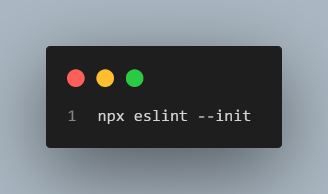
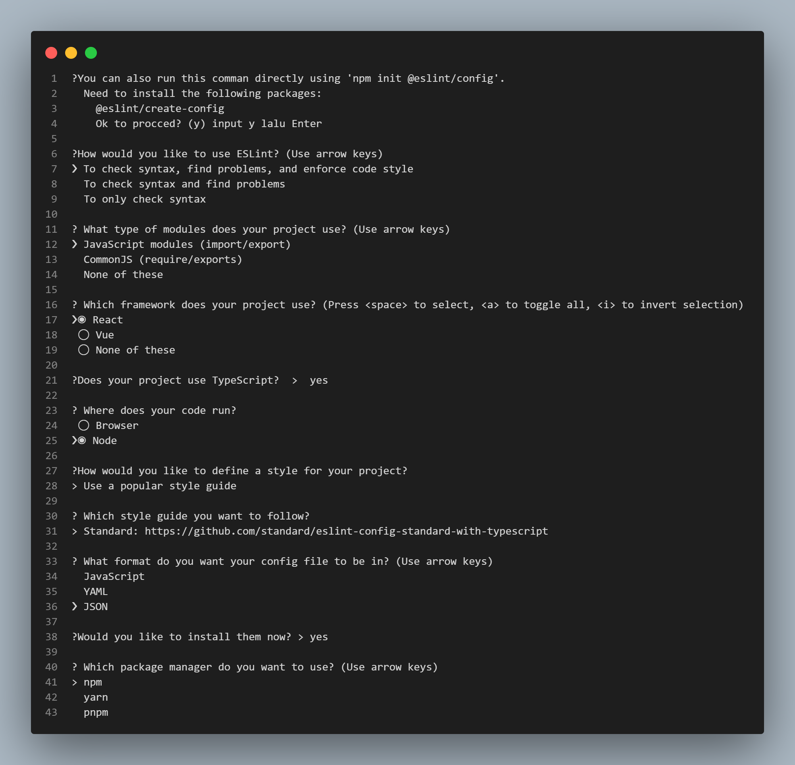
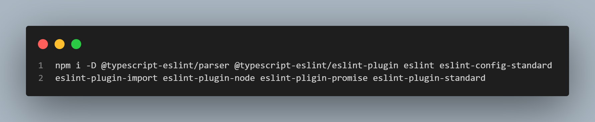
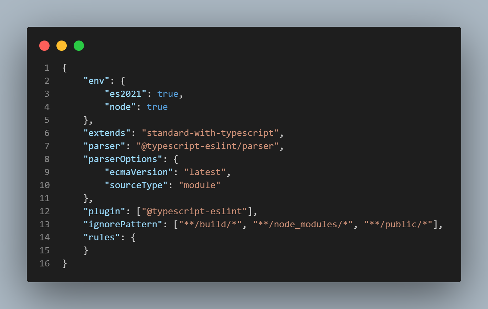
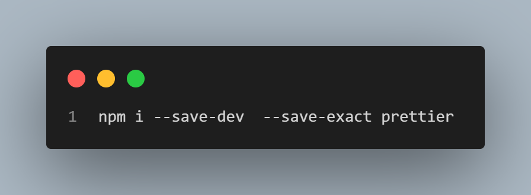
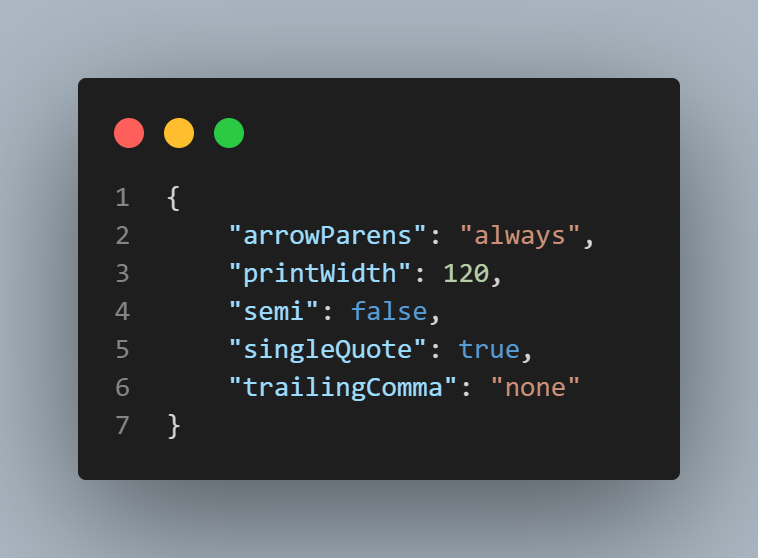
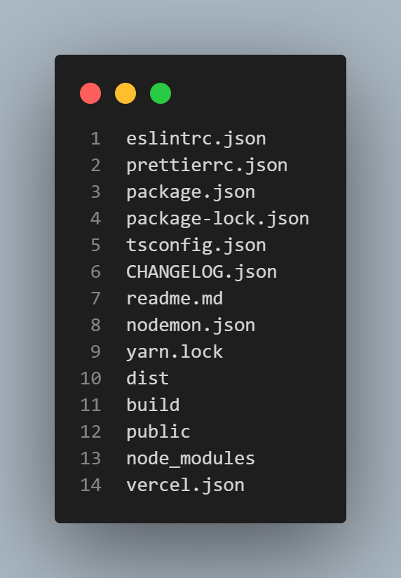
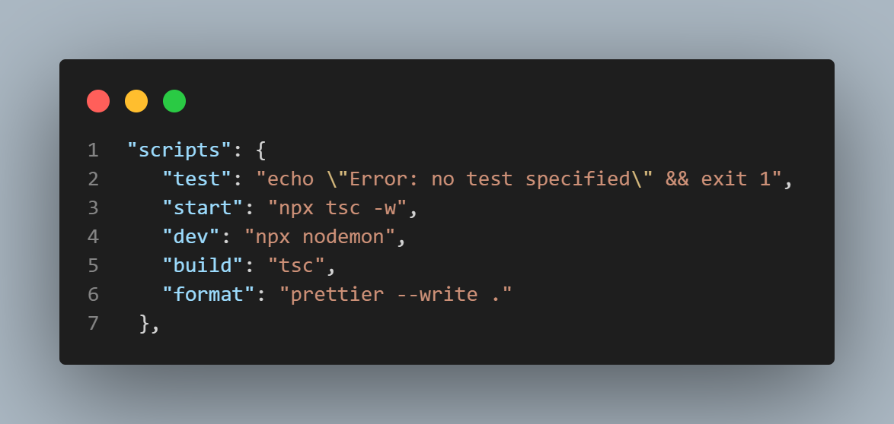

Ini adalah proyek backend yang dibuat menggunakan teknologi sebagai berikut:

1. TypeScript sebagai bahasa pemrograman
2. Express.js sebagai framework server
3. MongoDB sebagai database

Berikut adalah langkah-langkah untuk membuat proyek tersebut.

# Inisialisasi Proyek

Untuk menginisialisasi proyek, jalankan perintah berikut:  

# Instalasi TypeScript

Untuk menginstal TypeScript pada pengembangan, jalankan perintah berikut: 

# Konfigurasi TypeScript

Untuk mengkonfigurasi TypeScript, jalankan perintah berikut: 

Setelah itu, ubah file tsconfig.json seperti berikut: 

# Instalasi Nodemon

Untuk menginstal Nodemon, jalankan perintah berikut: 

# Konfigurasi Nodemon

Untuk mengkonfigurasi Nodemon, buat file nodemon.json dan isi dengan kode berikut: 

# Konfigurasi package.json

Untuk mengkonfigurasi package.json, ubah script menjadi seperti berikut: 

# Uji Proyek

Untuk menguji proyek, buat file server.ts pada folder src dan isi dengan kode berikut: 

Lalu jalankan perintah npm run dev di terminal VSCode. Jika berhasil, maka hasilnya akan seperti berikut: 

# Instalasi Express.js

Untuk menginstal Express.js, jalankan perintah berikut: 

# Instalasi @types/express

Untuk menginstal @types/express, jalankan perintah berikut: 

# Konfigurasi EsLint

Untuk mengkonfigurasi EsLint pertama jalankan perintah berikut: 
 
setelah itu pilih (y) lalu enter  
Setelah itu akan muncul beberapa pertanyaan:  

1.   
2. setelah langkah-langkah diatas selesai maka jalankan perintah berikut:  
   

# Konfigurasi file .eslintrc.json  

# Instalasi Prettier

1. isntall extension terlebih dahulu
2. lalu install prettier dengan perintah:  
   

# Konfigurasi Prettier
1. Buat file dengan nama .prettierrc
2. setelah itu isi file tersebut dengan:  
   
3. lalu buat file .prettierignore dan isi file tersebut dengan:  
   
4. edit file package.json  
   